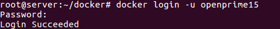
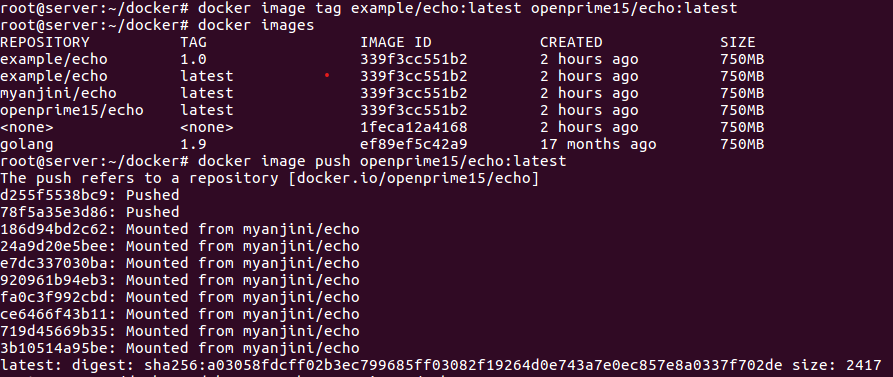

### 도커 관련 명령어

* Container process 확인
  * docker container ps
  * docker container ps -a 
    * 지금까지 생성되었던 모든 컨테이너 확인
* Container 실행 / 중지 
  * docker container stop Container_ID
  * docker container start Container_ID
* 백그라운드 실행 컨테이너에 접속
  * docker attach *CONTAINER_ID_or_NAME*
* 실행 명령어
  * root@server:~/docker# docker container run -p 9000:8080   example/echo:latest
  * root@server:~/docker# docker container run -p 9000:8080 -d  example/echo:latest
    * Background 실행(Container_ID가 표시됨)
  * root@server:~/docker# docker container run -p 9000:8080 -it example/echo:latest
    * 입출력을 공유하는 옵션 (명령어 쓸 수 있음), 나갈 수 있음(Ctrl+C)
  * root@server:~/docker# docker container run -p 9000:8080 -itd example/echo:latest
    * 입출력을 공유, 백그라운드 실행(Container_ID가 표시됨)
  * root@server:~/docker# docker container run -p 9000:8080 -it example/echo:latest /bin/bash
    * bash 명령어 실행 가능, 호스트 주소가 컨테이너로 바뀜, 나갈 수 있음(exit or Ctrl+PQ)
  * root@server:~/docker# docker container run -p 9000:8080 -itd example/echo:latest /bin/bash
    * bash 명령어 실행 가능, 백그라운드 재생이므로  호스트 주소가 바뀌지는 않음, 나갈 수 있음( exit or Ctrl+PQ)
  * root@server:~/docker# docker container run -p 9003:8080 -itd --name CONTAINER_NAME example/echo:latest /bin/bash
* 실행중인 컨테이너를 모두 중지
  * docker container stop $(docker container ls -q)
    * -q: 컨테이너 ID를 가져옴

### 도커

* 도커 이미지를 도커 허브에 등록

  * 이미지명을 **DOCKERHUB_ID/**IMAGE_NAME:TAG_NAME 형식을 준수
  * docker login 명령어로 docker hub에 로그인
  * docker image push 명령어로 이미지를 등록

* 도커 허브에 로그인

  

* 도커에 push

* 모든 이미지 제거

  * docker image rm -f $(docker image ls -q)

  
