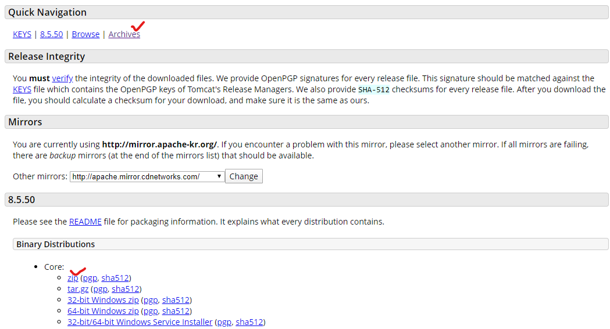
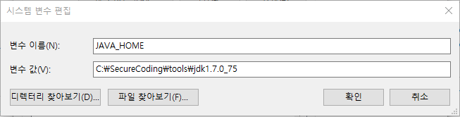
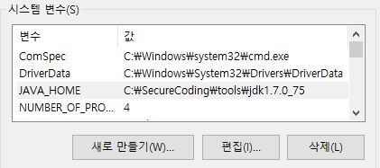
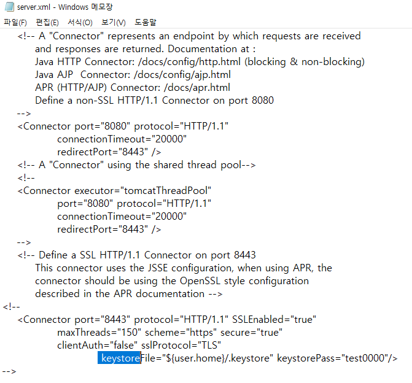

### Apach-tomcat 설치하기

1. http://tomcat.apache.org/  접속
2. 
   1. Archives → /bin 으로 들어가서 설치
   2. zip 다운로드
3. JAVA_HOME 설정
   
4. Keystore 오류시 편집
5.  apache-tomcat / bin / startup.bat 실행
6. localhost:8080 으로 확인

